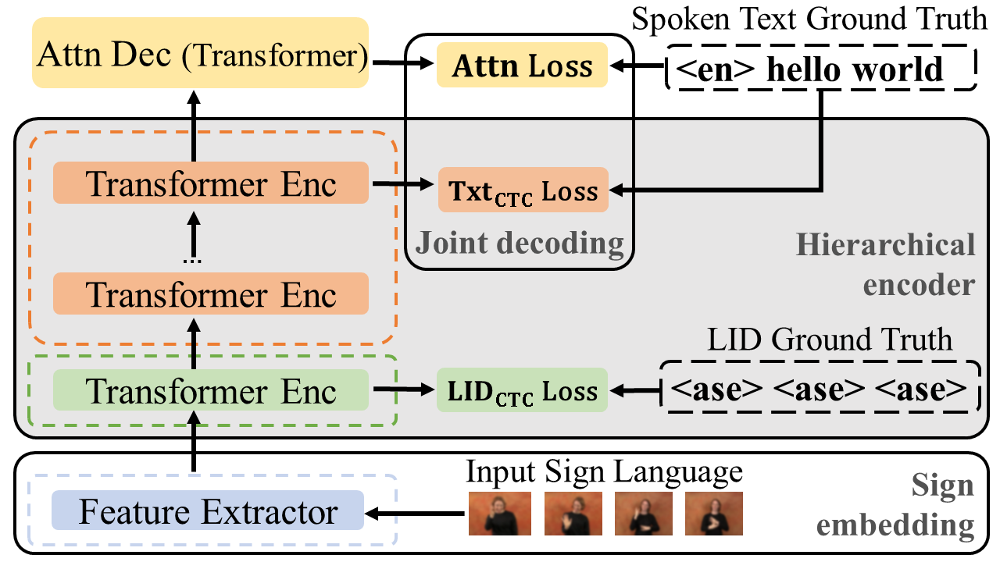

# Gloss-free-MLSLT (ACL2025)

Official Implementation of paper "Multilingual Gloss-free Sign Language Translation:
Towards Building a Sign Language Foundation Model"

## Paper Highlights
We propose a multilingual gloss-free model with dual CTC objectives for token-level SL identification and spoken text generation. Our model supports 10 SLs and handles one-to-one, many-to-one, and many-to-many SLT tasks, achieving competitive performance compared to state-of-the-art methods on three widely adopted benchmarks: multilingual SP-10, PHOENIX14T, and CSL-Daily.

## Proposed Method Overview



## How to start?

**Feature Extractor**

Please follow the intructions of [SlowFastSign](https://github.com/kaistmm/SlowFastSign) to extract sign features (Please note we **don't** use Gloss, instead use spoken text as supervision.).

You can get the checkpoints of our gloss-free One-to-one SLT model from [HERE](https://drive.google.com/drive/folders/1vx2eNHVaZKCCqxbIxTXdcYA9q7ljSyMP?usp=sharing)


## Citation 

If you find our work useful for your research, please cite our work with the following bibtex:

```bibtex

```
